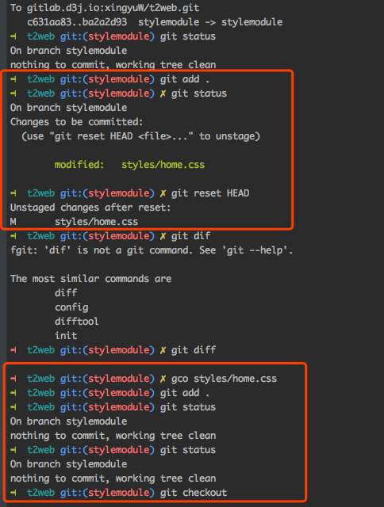

!
<!-- more -->


### npm
输入指令查询全局模块安装路径
``` 
npm list -g --depth=0
```

### 端口占用问题
``` 
lsof -i tcp:3000        // 查看占用端口程序
kill pid                // 杀进程
```

`如果 kill pid 无法关闭进程，可以使用 Mac 系统可以使用 alfred 的 kill 插件进行关闭`


### git
